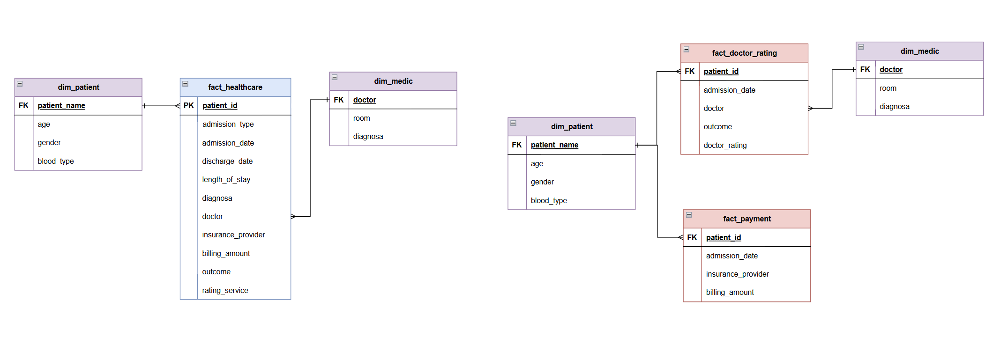

> Industri kesehatan menghasilkan data yang sangat besar dan beragam, mulai dari informasi pasien, dokter, rumah sakit, hingga catatan pengobatan. Sayangnya, data ini sering tersimpan dalam bentuk mentah yang terpisah-pisah, tidak konsisten, dan sulit diolah untuk analisis. untuk mengatasi masalah tersebut diperlunya membangun sebuah sistem data yang terintergarasi dalam data warehouse berbasis star schema untuk kebutuhan monitoring, serta mengembangkan dashboard  sebagai sarana decision making.

## End-to-End Data Architecture

Arsitektur sistem menggunakan:
- *Data Source*: generate data dummy menggunakan producer.py
- *Data Integration*: Script Python untuk memuat data ke Google BigQuery pada layer `raw`.
- *Data Transformation*: DBT digunakan untuk membuat tabel `staging`, `model`, dan `data mart` serta validasi data pada layer model.
- *Data Orchestration*: Apache Airflow mengatur urutan eksekusi job.
- *Notification*: notification pipeline mengirim status pipeline (success/failure) 
- *Visualization*: Tableu digunakan untuk membuat dashboard interaktif.

Flow:
`producer.py → RAW → STAGING → MODEL → Validasi data → MART → Tableu`

## Data Model (Star Chema) Healthcare

Struktur Star Schema pada Data Warehouse:
- *Fact Table*: 
    - `fact_healthcare` Menyimpan data detail aktivitas admission pasien.
    - `fact_doctor_rating` Menyimpan informasi terkait rating dokter dan outcome pasien pada setiap admission.
    - `fact_payment` Menyimpan informasi terkait pembayaran pasien, termasuk insurance_provider dan billing_amount.

- *Dimension Tables*:
    - `dim_patient`: Berisi informasi pasien seperti usia, gender, dan golongan darah.
    - `dim_doctor`: Berisi informasi medis, mencakup nama dokter, diagnosa, dan ruangan.

## Dags Design
> menggunakan airflow sebagai orchestration pada proyek ini. disini ada 3 dags yang berfungsi antara lain:

### Dag Producer --python

- berfungsi untuk menghasilkan data dummy atau simulasi data pasien secara terus-menerus.
- Data tersebut ditulis ke healthcare_data.csv yang di simpan ke dalam folder tmp.
- Setelah proses producer selesai, Airflow secara otomatis menjalankan DAG Data Transformation untuk memproses data lebih lanjut.

### Dag Extraction --python

- Membuat dataset baru di Google BigQuery menggunakan credentials.json melalui script Python.
- Mengunggah data mentah (raw data) dari healthcare_data.csv ke tabel BigQuery.
- Menambahkan jeda proses untuk memastikan data berhasil terunggah sepenuhnya.
- Setelah proses extract selesai, Airflow secara otomatis menjalankan DAG Data Transformation untuk memproses data lebih lanjut.

### Data Transformation --DBT

- Membuat tabel staging di BigQuery dengan data yang sudah dibersihkan dan distandarisasi.
-  Membangun data model sesuai kebutuhan analisis, seperti tabel dimensi dan fakta.
- Melakukan data testing menggunakan DBT untuk memastikan kualitas data sesuai kriteria.
- Data Mart Membuat data mart siap pakai untuk analisis dan visualisasi.

## Dashboard
> terdapat 3 analitik yang bisa di lihat pada dashboard di bawah ini.
- Overall patients Dashboard

- Doctor Performance Dashboard

- Patient Payments Dashboard
